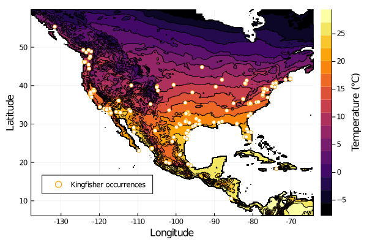

# `SimpleSDMLayers.jl`: A Basis for Species Distribution Modelling in Julia

  

This repository contains the resources for our JuliaCon 2020 poster presenting
`SimpleSDMLayers.jl`, a package for species distribution modelling in _Julia_. 
Take a look at the poster [here](juliacon-poster.pdf).

Interested to try to package? Check out this [script](main.jl) or try running
this [NextJournal notebook](https://nextjournal.com/gabrieldansereau/SimpleSDMLayers-JuliaCon2020-demo/).

For more advanced examples, check out the [documentation for the package](https://ecojulia.github.io/SimpleSDMLayers.jl/latest/).